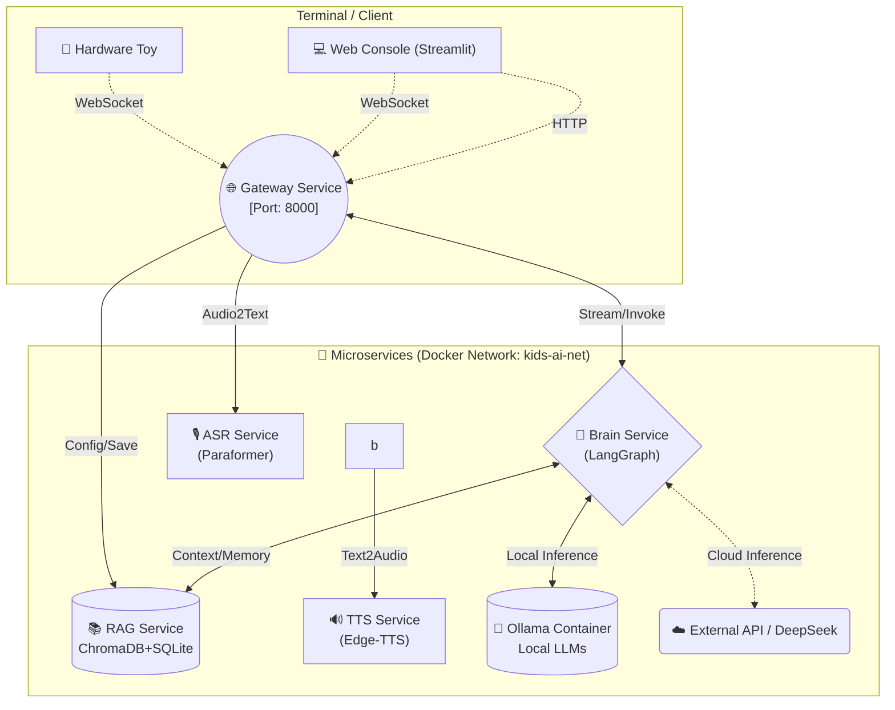

<div align="center">
  <h1>🧸 KidsEduToy AI </h1>
  <p><b>儿童教育智能玩具 - 独立全栈架构 AI 应用系统</b></p>

  <p>
    
    
    
    
    
  </p>
</div>

---

## 📖 简介 (Overview)

`kids-edu-toy-ai` 是一款专为**儿童教育智能硬件实体玩具**打造的后端智能大脑应用。
该系统采用 **高度解耦的微服务架构 (Microservices)** 与 **全栈 Docker 容器化部署**。通过 WebSocket 网关为终端玩具提供“近乎零延迟”的流式交互体验。它不仅集成了业界前沿的智能体工作流引擎、检索增强生成 (RAG)，还首创了“云端大模型”与“断网/本地化 Ollama”的**混合双引擎热切换**设计。

✨ 给孩子一台不仅能听懂他们，还会**自主记忆并共同成长**的实体玩伴伴侣！

---

## 🌟 核心亮点 (Key Features)

*   🚀 **真·流式全双工架构 (True Streaming)**：自研分包算法，打通从 API Gateway -> LangGraph (Brain) -> Ollama 底层推理机制的流式通信，首字响应低至百毫秒级。
*   🧠 **智能体状态机 (LangGraph Orchestration)**：内置复杂路由引擎，能精准识别儿童发问意图并执行独立流：
    *   📘 **故事引擎**（发散创作与配音）
    *   ❓ **知识问答**（启动增强 RAG 引擎）
    *   💬 **日常闲聊**（纯净安全交互与情绪疏导）
*   💾 **自动化三层记忆体系 (Memory & RAG)**：
    *   提供独立文档向量库，配合 ChromaDB + BM25 的准确混合检索。
    *   智能捕捉儿童兴趣点/偏好，通过隐式元控制标签 `<UPDATE_MEMORY>` 无感录入。长期记忆真正落盘，越聊越精准。
*   🔌 **本地与云端自由切换 (Hybrid LLM Support)**：
    *   **本地隐私模式**：内置挂载 Ollama 对接容器（默认推荐 `qwen3.5:2b` 等小模型针对笔记本级显卡进行推理）。
    *   **云端强大模式**：支持一键热重载切换 DeepSeek (V3/R1) 或 GLM-4 等顶级云服务 API。
*   🎙️ **前后端一体双模 (ASR & TTS)**：不仅接管硬件玩具协议，也为开发者附带了基于 Streamlit 的可视化 Web 控制台，点开即玩。

---

## 🏗️ 系统架构图 (Architecture)



### 微服务清单：
| 服务组件 | 端口 | 核心技术栈 | 职责简述 |
| :--- | :--- | :--- | :--- |
| **`gateway`** | `8000` | FastAPI, WebSockets | 流量中枢，管理 WebSocket 连接与消息分发请求。 |
| **`brain`** | `8004` | LangChain, LangGraph | AI 主控引擎、意图分类与提示词动态编排。 |
| **`rag`** | `8003` | LlamaIndex, ChromaDB | 知识库持久化向量检索，提供配置级 KV 存储。 |
| **`asr`** | `8001` | FunASR (SenseVoice) | 将收到的二进制音频流离线转写为文本。 |
| **`tts`** | `8002` | Edge-TTS | 获取文本块后流式合成高逼真自然语音包。 |
| **`frontend`** | `8501` | Streamlit | 为家长/开发者提供图形化调试台及配置页面。 |
| **`ollama`** | `11434` | Ollama Cpp | GPU 硬件加速的离线本地量化大语言模型运行库。 |

---

## ⚙️ 快速上手 (Quick Start)

### 1. 环境先决条件 (Prerequisites)
- 操作系统 Windows / Linux / macOS。
- 已安装 [Docker Desktop](https://www.docker.com/products/docker-desktop/) 及最新版的 `docker-compose`。
- *(可选推荐)* 若期望使用显卡全速运行本地大模型，需安装 NVIDIA 原厂显卡驱动及对应的 [NVIDIA Container Toolkit](https://docs.nvidia.com/datacenter/cloud-native/container-toolkit/install-guide.html)。

### 2. 克隆项目与启动环境
```bash
# 1. 克隆代码库
git clone https://github.com/your-username/kids-edu-toy-ai.git
cd kids-edu-toy-ai

# 2. 检查或新建数据持久化目录
mkdir data
mkdir test

# 3. 以后台挂起模式同时构建并拉起整个微服务集群
docker-compose up -d --build
```
*(注：首次构建时会安装众多如 PyTorch、FunASR 等巨型 Python 依赖，视网速可能需要数十分钟。)*

### 3. 配置与体验交互界面
成功启动后，使用浏览器访问：**[http://localhost:8501](http://localhost:8501)** 即可进入可视化控制台。

*   **云端 API 快速配置**：如果你因为显存受限不想用本地模型，请在页面底部将 **“引擎偏好”** 切换至 `Cloud (API)`。随后填写你的 DeepSeek 或智谱大语言模型 API Key，点击 **「💾 保存设置为系统默认」**，即可永久生效。
*   **本地大模型配置**：若拥有 `16GB` 及以上显存的独立显卡，可以点击控制台中的**“拉取 Ollama 本地模型”**按钮（填入如 `qwen3.5:2b`）。等待模型分配完成，将主会话栏引擎切为 `Local` 即可断网可用！

---

## 📡 硬件终端 WebSocket API 文档

如果你是固件开发者，希望将儿童硬件玩具连接至本服务，请使用 `ws://<Server IP>:8000/ws` 并遵守以下双工通讯 JSON 协议：

**请求载荷示例 (Request Payload)**:
```json
{
  "action": "chat",                  // 发送文本动作（语音为 "audio"）
  "session_id": "device_user_A01",   // 用以隔离区分不同儿童的历史记忆状态
  "data": {
    "text": "我想听白雪公主吃毒苹果的故事！", // 文本输入内容
    "context": {"child_age": 6}      // (可选) 附加状态，如玩具当前所处的模式/年龄
  }
}
```

**响应推送流示例 (Streaming Response Streams)**:
```json
{"type": "text_chunk", "data": {"text": "好的呀！"}}
{"type": "audio_chunk", "data": {"audio": "<Base64 Encoded Wav Header Chunk>"}}
{"type": "text_chunk", "data": {"text": "白雪公主为了..."}}
{"type": "response_complete", "data": {"full_text": "好的呀！白雪公主为了..."}}
```
硬件端收到 `audio_chunk` 后可直接将拿到的 base64 还原成二进制注入喇叭缓冲区形成不间断播放。

---

## 📂 项目目录树形结构
```text
kids-edu-toy-ai/
├── data/                  # 持久化数据与缓存（会自动添加至 .gitignore）
│   ├── rag_data/          # 存放 ChromaDB 向量缓存库、SQLite 表
├── docs/                  # 详细架构图与深入微服务设计说明文档
│   ├── ...
├── models/                # 可存放你自主微调的外部 Lora 参数
├── scripts/               # 独立的手工运维工具包与脚本库 (如全局重新编排索引等)
├── services/              # ✅ 核心分布式微服务代码总集
│   ├── asr/
│   ├── brain/
│   ├── frontend/
│   ├── gateway/
│   ├── rag/
│   └── tts/
├── test/                  # 各微服务的集成测试与接口沙箱回归运行代码
├── docker-compose.yml     # 🚀 容器服务全栈互通编排网络配置
└── requirements.txt       # 全局基底引用依赖
```

---

## 🤝 开发与贡献 (Contributing)
如果你在此架构上扩展出了新功能（比如增加了视觉捕捉服务 Vision Service），欢迎发起 Pull Request：
1. Fork 出你的私有分支 (`git checkout -b feature/AmazingFeature`)。
2. 将新增的服务模块存放在 `services/`，并在 `docker-compose.yml` 中注册路由网桥暴露。
3. 如果修改了 `gateway` 流式解析，请务必执行 `python test/integration_chat_flow.py` 回归测试流式组帧成功。
4. Push 并创建拉取请求！

## 📄 清单与开源许可 (License)
本项目遵守 [MIT License](LICENSE)。你可以不受限地自由下载、商用修改。
