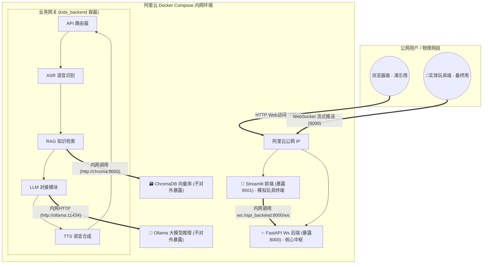

# KidsEduToy AI - 架构设计与实施计划

## 1. 系统架构图设计 (部署基准环境: Docker)

## 2. 内外网 IP 切换与联调逻辑 (核心难点解答)

在部署到阿里云时，**“内网通信”和“公网暴露”绝不能混淆**：

1. **容器内网通信 (走 Docker 内部 DNS，极快且免费)**：
   * 你的 **FastAPI 后台代码**在调大模型时，地址必须写 `http://ollama:11434`（因为它们在同一个 docker-compose 网络里，用服务名直接当域名）。
   * 你的 **Streamlit 前端**在连接 FastAPI 时，如果 Streamlit 和 FastAPI 都在后端网络里，它连的 Ws 地址应该是 `ws://api_backend:8000/ws`。
2. **公网暴露 (走阿里云公网 IP，给用户和玩具连的)**：
   * 我们会在 docker-compose 配置文件里，把 Streamlit 的 8501 端口和 FastAPI 的 8000 端口映射到宿主机 (`ports: -"8000:8000"`).
   * **最终玩具里的代码**，连的则是：`ws://<你的阿里云公网IP>:8000/ws`。
   * **你的电脑浏览器**，访问的是：`http://<你的阿里云公网IP>:8501`。

## 3. 实施路径 (Action Items)

本项目接下来将分以下几步完成“全栈容器化重构”：

- [ ] **1. 清理臃肿代码**：移除 `modules/llm.py` 中原生读取和吃内存的 `transformers/peft` 模型加载代码。
- [ ] **2. 编写 Streamlit 演示前端 (`src/frontend/app.py`)**：写一个全栈可视化 UI，有一个大录音按钮，模拟玩具，能录音、发送、然后流式接收文字并播放合成的童声。
- [ ] **3. 后端对接重构 (`modules/llm.py`)**：改为使用 Langchain 异步对接内部 Ollama 微调后的 Qwen 模型接口。
- [ ] **4. 编写 All-in-One 部署文件 (`docker-compose.yml`)**：包含独立的大模型容器(`ollama`)、业务控制容器(`backend`)和全栈UI展现容器(`frontend`)，并配好内网域名解析。
- [ ] **5. 云部署与公网透传联调**：在阿里云上 `docker-compose up -d`，把模型文件送入 Ollama，并配置服务器安全组放行 8000 和 8501 端口！
