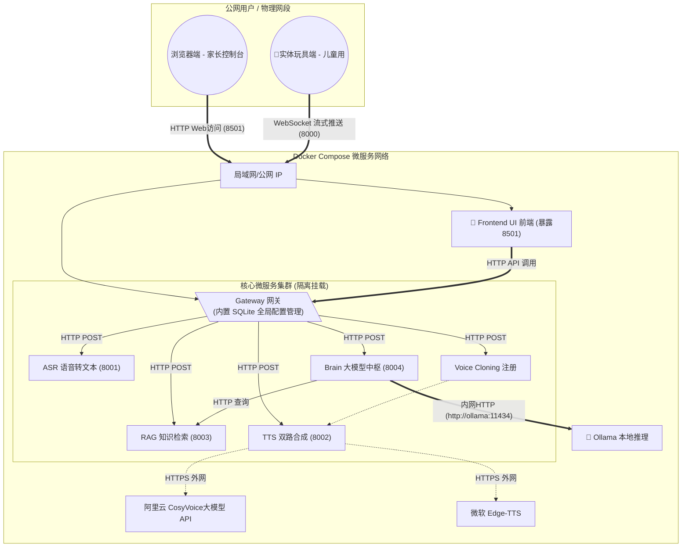

# KidsEduToy AI - 架构设计与实施计划

## 1. 系统架构图设计 (部署基准环境: Docker)

## 2. 内外网 IP 切换与联调逻辑 (核心难点解答)

在部署到阿里云时，**“内网通信”和“公网暴露”绝不能混淆**：

1. **容器内网通信 (走 Docker 内部 DNS，极快且免费)**：
   * 你的 **FastAPI 后台代码**在调大模型时，地址必须写 `http://ollama:11434`（因为它们在同一个 docker-compose 网络里，用服务名直接当域名）。
   * 你的 **Streamlit 前端**在连接 FastAPI 时，如果 Streamlit 和 FastAPI 都在后端网络里，它连的 Ws 地址应该是 `ws://api_backend:8000/ws`。
2. **公网暴露 (走阿里云公网 IP，给用户和玩具连的)**：
   * 我们会在 docker-compose 配置文件里，把 Streamlit 的 8501 端口和 FastAPI 的 8000 端口映射到宿主机 (`ports: -"8000:8000"`).
   * **最终玩具里的代码**，连的则是：`ws://<你的阿里云公网IP>:8000/ws`。
   * **你的电脑浏览器**，访问的是：`http://<你的阿里云公网IP>:8501`。

## 3. 实施路径 (Action Items)

本项目接下来将分以下几步完成“全栈容器化重构”：

- [ ] **1. 清理臃肿代码**：移除 `modules/llm.py` 中原生读取和吃内存的 `transformers/peft` 模型加载代码。
- [ ] **2. 编写 Streamlit 演示前端 (`src/frontend/app.py`)**：写一个全栈可视化 UI，有一个大录音按钮，模拟玩具，能录音、发送、然后流式接收文字并播放合成的童声。
- [x] **3. 后端对接重构 (`modules/llm.py`)**：改为使用 Langchain 异步对接内部 Ollama 微调后的 Qwen 模型接口。
- [x] **4. 编写 All-in-One 部署文件 (`docker-compose.yml`)**：包含独立的大模型容器(`ollama`)、业务控制容器(`backend`)和全栈UI展现容器(`frontend`)，并配好内网域名解析。
- [ ] **5. 云部署与公网透传联调**：(已延期，见附注)

## 附注: 阿里云部署硬件限制与测略调整 (2026-03)

针对目标阿里云 ECS 服务器 (2C2G，纯 CPU)，由于内存 (2GB) 规格硬限制，无法完整支撑本系统包含的本地化大模型 (Ollama + 至少 1.5GB 内存) 和本地化语音识别 (FunASR + 至少 0.5GB 内存) 容器的同时运行。强行采用 `docker-compose up` 部署会导致 OOM (Out Of Memory) 崩溃。

**后续部署备选方案**:
1. **云端纯展示/代理网关**: 将 2C2G 服务器仅作为代理层和 Web UI (Streamlit + Gateway)，推理和语音业务使用内网穿透转发回本地硬件 (具有独立 GPU)。
2. **切换为云大厂 API**: 将 Ollama 容器替换为对外部商业大模型 (通义千问 API / 智谱 API等) 的轻量级 HTTP 调用，ASR 替换为调用阿里云公有云 API。
3. **升级 ECS 规格**: 对于全本地化容器部署，最低建议将规格升级至 4C8G。

当前阶段，我们暂停公有云的架构调优，将重心转移至基于本地化硬件环境的**功能优化 (Project Optimization)**，重点攻克 RAG 与大语言模型系统的高级整合。
